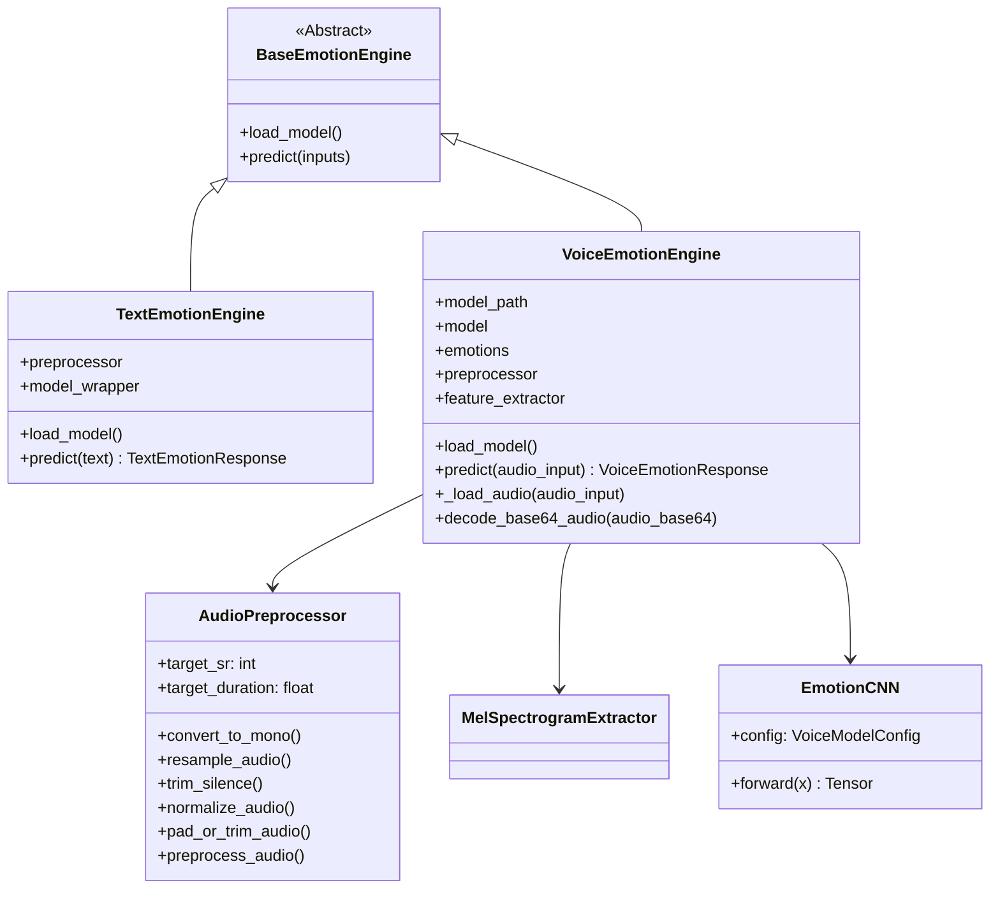

# EmotionAI

EmotionAI is a multi-modal emotion recognition platform designed to analyze emotional states from text and speech signals. The project focuses on providing robust, modular, and high-performance inference and preprocessing pipelines for developers and researchers.

---

## Current Project Status

The project has completed **Milestones 1-5** and is currently at **Milestone 5**, featuring:

1. **Fully Functional Text Emotion Inference Engine**: Integrates a HuggingFace DistilRoBERTa model fine-tuned on Ekman's basic emotions, operating offline with local model caching.
2. **Robust Voice Preprocessing Pipeline**: A production-grade digital signal processing (DSP) pipeline that standardizes multi-source speech files (RAVDESS and CREMA-D) offline to prepare them for neural network training.
3. **Log-Mel Feature Extraction**: Converts preprocessed audio waveforms into standardized 2D Log-Mel Spectrogram features (128x94) across all 10,322 samples.
4. **Voice Emotion Classifiers**: Two trained CNN models — VM/1 (8-class) and VM/2 (5-class with weighted loss and LR scheduling) — with full evaluation pipelines and comprehensive test suites.
5. **Unified FastAPI API**: Multi-modal REST API serving both text and voice emotion predictions with base64 audio support.

---

## Features Completed

### Text Emotion Engine
* **Standalone Preprocessing**: Standardizes input strings by cleaning whitespace, carriage returns, and newlines.
* **Transformer-Based Classifier**: Leverages the `j-hartmann/emotion-english-distilroberta-base` model.
* **Standardized JSON Schema**: Outputs predictions conforming to Pydantic models containing primary emotions, confidence values, and full emotion distributions.
* **Interactive CLI Demo**: A command-line script for testing predictions interactively.

### Voice Preprocessing Pipeline
* **Multi-Dataset Ingestion**: Scans, validates, and builds a metadata index of 10,322 `.wav` files across the RAVDESS and CREMA-D corpora.
* **Lazy Audio Loader**: Implements memory-efficient, lazy loading of high-dimensional audio arrays into memory only when requested.
* **Deterministic Offline DSP Pipeline**:
  1. **Stereo to Mono**: Halves storage and computing requirements.
  2. **Resampling**: Standardizes sample rate to 16 kHz.
  3. **Silence Trimming**: Removes non-speech intervals using a 30 dB threshold.
  4. **Peak Normalization**: Linearly scales files to maximize dynamic range without clipping.
  5. **Padding & Trimming**: Standardizes audio clip length to exactly 3.0 seconds (48,000 samples).
* **Comprehensive Metadata Tracking**: Generates detailed run logs, a JSON run configuration, and a CSV report mapping metrics for every sample.

### Log-Mel Feature Extraction
* **MelSpectrogramExtractor**: Computes 128-band Log-Mel Spectrograms from preprocessed audio (128x94 time-frequency resolution).
* **FeatureDatasetBuilder**: Orchestrates batch extraction across all 10,322 samples with full metadata tracking.
* **Portable Feature Index**: CSV index mapping features to source audio with multi-strategy path resolution.

### Voice Emotion Classifiers
* **VM/1 (8-Class)**: CNN trained on all RAVDESS/CREMA-D emotions with early stopping and checkpoint saving.
  * Val accuracy: 61.77% | F1: 66.05% | Trained 36/45 epochs (early stop at epoch 29)
* **VM/2 (5-Class)**: Weighted CrossEntropyLoss for class imbalance, ReduceLROnPlateau scheduler, metadata-rich checkpoints.
  * Val accuracy: 69.14% | F1: 72.70% | Trained 34/45 epochs (early stop at epoch 27)
  * Emotions: happy, sad, angry, fearful, calm
* **Evaluation Pipelines**: Automated metric computation (accuracy, precision, recall, F1), per-class reports, confusion matrix plots.
* **Interactive Inference Tester**: CLI tool supporting microphone recording or file input, with VM/1 and VM/2 model selection.

### Voice Inference Engine
* **`VoiceEmotionEngine`**: Production inference class inheriting from `BaseEmotionEngine`.
  * Auto-loads VM/2 metadata-rich checkpoints (model config + emotions embedded in checkpoint).
  * Chains: raw audio -> DSP preprocessing -> Mel spectrogram -> CNN -> emotion label.
  * Supports file paths, bytes, and file objects as input.
  * Proper temp file cleanup with `try/finally` blocks.
* **Pydantic Schemas**: `VoiceEmotionRequest` / `VoiceEmotionResponse` for API validation.

### FastAPI Multi-Modal API
* **`GET /health`**: Health check with model status.
* **`POST /api/v1/text/analyze`**: Text emotion analysis.
* **`POST /api/v1/voice/analyze`**: Voice emotion analysis from uploaded audio file.
* **`POST /api/v1/voice/analyze-base64`**: Voice emotion analysis from base64-encoded audio.
* **CORS**: Configurable allowed origins via settings.
* **Lifespan management**: Models loaded at startup, graceful shutdown.
* **Sanitized error messages**: Generic errors to clients, full details logged server-side.

---

## Project Architecture

### Class Layout & Interfaces



---

## Folder Structure

```
EmotionAI/
├── .agents/                    # Workspace agent guidelines & rules
├── backend/
│   ├── __init__.py
│   ├── app.py                  # FastAPI application
│   ├── config/
│   │   ├── __init__.py
│   │   └── config.py           # Pydantic Settings
│   └── emotion_engine/
│       ├── __init__.py
│       ├── common/             # Base abstractions & interfaces
│       │   ├── __init__.py
│       │   └── base_engine.py  # BaseEmotionEngine ABC
│       ├── text/               # Text preprocessor, model wrapper, & schemas
│       │   ├── __init__.py
│       │   ├── demo.py
│       │   ├── inference.py
│       │   ├── model.py
│       │   ├── preprocess.py
│       │   ├── schemas.py
│       │   └── test.py
│       └── voice/              # Voice loader, DSP, features, model, training, evaluation, & tests
│           ├── __init__.py
│           ├── dataset.py
│           ├── evaluate.py
│           ├── evaluate_v2.py
│           ├── features.py
│           ├── inference.py    # VoiceEmotionEngine
│           ├── loader.py
│           ├── model.py        # EmotionCNN + VoiceModelConfig
│           ├── preprocess.py
│           ├── schemas.py      # VoiceEmotionRequest/Response
│           ├── train.py
│           ├── train_v2.py
│           └── test_*.py       # 111 tests total
├── datasets/
│   ├── metadata/               # Unified CSV dataset metadata index
│   ├── processed/              # Preprocessed standardized audio files (ignored in git)
│   │   └── metadata/           # Config JSON and CSV reports
│   └── features/               # Log-Mel spectrogram .npy files
│       └── metadata/           # Feature index, config, and extraction reports
├── docs/                       # Project reports & design specs
├── models/                     # Trained model checkpoints
│   ├── best_voice_model.pth    # VM/1 (8-class, 22MB)
│   └── best_voice_model_v2.pth # VM/2 (5-class, 67MB)
├── reports/                    # Evaluation reports and confusion matrices
│   ├── *.json, *.txt, *.png    # VM/1 reports
│   └── v2/                     # VM/2 reports
├── requirements.txt            # Project dependencies
└── README.md                   # This file
```

---

## Technologies Used

* **Core Language**: Python (>= 3.10)
* **Deep Learning & NLP**: PyTorch, HuggingFace Transformers
* **Audio Digital Signal Processing**: Librosa, SoundFile, NumPy
* **Machine Learning Metrics**: Scikit-learn
* **Web Framework**: FastAPI, Uvicorn
* **Schemas & Config**: Pydantic v2, Pydantic Settings
* **CLI Utilities**: tqdm, argparse
* **Testing**: Pytest

---

## Setup & Execution Instructions

> **Note:** Audio datasets (RAVDESS and CREMA-D) are **NOT included** in this repository due to their size. They must be downloaded and placed manually in the `datasets/raw/` directory.

### 1. Environment Setup

Clone the repository and set up a Python virtual environment:

```bash
# Clone the repository
git clone https://github.com/AshwinKumarL/EmotionTrack-AI.git
cd EmotionTrack-AI

# Create virtual environment
python -m venv .venv

# Activate virtual environment (Windows PowerShell)
.venv\Scripts\Activate.ps1

# Install dependencies
pip install -r requirements.txt
```

### 2. Dataset Placement

Place the raw datasets in the following hierarchy:

* **RAVDESS**: Extract actor folders (e.g., `Actor_01/` to `Actor_24/`) to `datasets/raw/RAVDESS/`
* **CREMA-D**: Extract WAV files directly to `datasets/raw/CREMA-D/`

### 3. Run Preprocessing Pipeline

Run the offline preprocessor to standardize raw audio and generate reports:

```bash
python backend/emotion_engine/voice/preprocess.py
```

### 4. Run Feature Extraction

Extract Mel spectrogram features from preprocessed audio:

```bash
python backend/emotion_engine/voice/features.py
```

### 5. Train Models

```bash
# Train VM/1 (8-class)
python backend/emotion_engine/voice/train.py

# Train VM/2 (5-class with weighted loss)
python backend/emotion_engine/voice/train_v2.py
```

### 6. Run Evaluation

```bash
# Evaluate VM/1
python backend/emotion_engine/voice/evaluate.py

# Evaluate VM/2
python backend/emotion_engine/voice/evaluate_v2.py
```

### 7. Start the API Server

```bash
uvicorn backend.app:app --reload --host 0.0.0.0 --port 8000
```

API docs available at: `http://localhost:8000/docs`

### 8. Run Interactive Text Demo

Analyze text emotion interactively in the terminal:

```bash
python backend/emotion_engine/text/demo.py
```

### 9. Running Tests

Execute the full test suite (111 tests):

```bash
pytest -v
```

---

## API Endpoints

| Method | Endpoint | Description |
|--------|----------|-------------|
| `GET` | `/health` | Health check with model status |
| `POST` | `/api/v1/text/analyze` | Analyze text emotion |
| `POST` | `/api/v1/voice/analyze` | Analyze voice from uploaded audio file |
| `POST` | `/api/v1/voice/analyze-base64` | Analyze voice from base64-encoded audio |

### Example Request (Text)

```bash
curl -X POST http://localhost:8000/api/v1/text/analyze \
  -H "Content-Type: application/json" \
  -d '{"text": "I am so happy today!"}'
```

### Example Request (Voice - File Upload)

```bash
curl -X POST http://localhost:8000/api/v1/voice/analyze \
  -F "file=@sample.wav"
```

### Example Response

```json
{
  "primary_emotion": "Happy",
  "confidence": 0.8734,
  "probabilities": {
    "happy": 0.8734,
    "sad": 0.0312,
    "angry": 0.0198,
    "fearful": 0.0489,
    "calm": 0.0267
  },
  "model_version": "v2"
}
```

---

## Model Comparison

| Aspect | VM/1 | VM/2 |
|--------|------|------|
| **Classes** | 8 emotions | 5 emotions |
| **Val Accuracy** | 61.77% | 69.14% |
| **Macro F1** | 66.05% | 72.70% |
| **Loss Function** | CrossEntropyLoss | Weighted CrossEntropyLoss |
| **LR Scheduler** | None | ReduceLROnPlateau |
| **Checkpoint** | Bare state_dict | Metadata-rich (config + emotions embedded) |
| **Best Epoch** | 29/45 | 27/45 |

---

## Test Coverage

111 tests across all modules:

| Module | Tests | Coverage |
|--------|-------|----------|
| Voice Schemas | 9 | Request/response validation |
| Voice Inference | 16 | Engine init, load, predict, temp file cleanup |
| Voice Model | 7 | Config validation, forward pass, gradients |
| Voice Dataset | 9 | Label encoder, dataset loading, error handling |
| Voice Loader | 14 | RAVDESS/CREMA-D parsing, metadata extraction |
| Voice Features | 6 | Mel spectrogram extraction, save/load |
| Voice Preprocess | 5 | DSP pipeline stages |
| Voice Train | 4 | Config, data splitting, checkpoint saving |
| Voice Train V2 | 7 | V2 index, class weights, training loop |
| Voice Evaluate | 6 | Model loading, confusion matrix, pipeline |
| Voice Evaluate V2 | 7 | V2 model loading, per-class metrics |
| Voice Test Voice | 2 | CLI tester basic functionality |
| Text Engine | 4 | Text emotion inference |
| FastAPI App | 10 | All API endpoints with mocked engines |
| Config | 6 | Settings defaults and validation |
| **Total** | **111** | |

---

## Future Roadmap

1. **Frontend Dashboard**: React/Vue dashboard for real-time emotion visualization.
2. **WebSocket Streaming**: Real-time audio streaming for live emotion detection.
3. **Model Optimization**: Quantization and ONNX export for production deployment.
4. **Multi-language Support**: Extend text emotion engine to support non-English languages.
