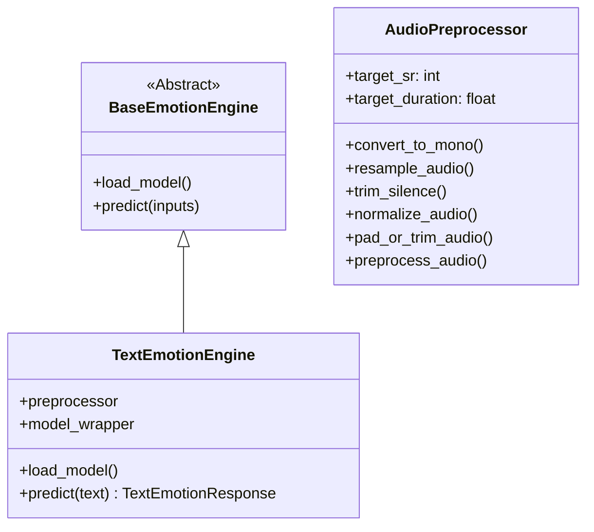

# EmotionAI

EmotionAI is a multi-modal emotion recognition platform designed to analyze emotional states from text and speech signals. The project focuses on providing robust, modular, and high-performance inference and preprocessing pipelines for developers and researchers.

---

## Current Project Status

The project is currently at **Milestone 1**, featuring:
1. **Fully Functional Text Emotion Inference Engine**: Integrates a HuggingFace DistilRoBERTa model fine-tuned on Ekman's basic emotions, operating offline with local model caching.
2. **Robust Voice Preprocessing Pipeline**: A production-grade digital signal processing (DSP) pipeline that standardizes multi-source speech files (RAVDESS and CREMA-D) offline to prepare them for neural network training.

---

## Features Completed

### 📝 Text Emotion Engine
* **Standalone Preprocessing**: Standardizes input strings by cleaning whitespace, carriage returns, and newlines.
* **Transformer-Based Classifier**: Leverages the `j-hartmann/emotion-english-distilroberta-base` model.
* **Standardized JSON Schema**: Outputs predictions conforming to Pydantic models containing primary emotions, confidence values, and full emotion distributions.
* **Interactive CLI Demo**: A command-line script for testing predictions interactively.

### 🎙️ Voice Preprocessing Pipeline
* **Multi-Dataset Ingestion**: Scans, validates, and builds a metadata index of 10,322 `.wav` files across the RAVDESS and CREMA-D corpora.
* **Lazy Audio Loader**: Implements memory-efficient, lazy loading of high-dimensional audio arrays into memory only when requested.
* **Deterministic Offline DSP Pipeline**:
  1. **Stereo to Mono**: Halves storage and computing requirements.
  2. **Resampling**: Standardizes sample rate to 16 kHz.
  3. **Silence Trimming**: Removes non-speech intervals using a 30 dB threshold.
  4. **Peak Normalization**: Linearly scales files to maximize dynamic range without clipping.
  5. **Padding & Trimming**: Standardizes audio clip length to exactly 3.0 seconds (48,000 samples).
* **Comprehensive Metadata Tracking**: Generates detailed run logs, a JSON run configuration, and a CSV report mapping metrics for every sample.

---

## Project Architecture

### Class Layout & Interfaces



---

## Folder Structure

```
Emotion App - Ashwin/
├── .agents/                    # Workspace agent guidelines & rules
├── backend/
│   ├── config/                 # Application config & Pydantic settings
│   └── emotion_engine/
│       ├── common/             # Base abstractions & interfaces
│       ├── text/               # Text preprocessor, model wrapper, & schemas
│       └── voice/              # Voice loader, DSP preprocessor, & tests
├── datasets/
│   ├── metadata/               # Unified CSV dataset metadata index
│   └── processed/              # Preprocessed standardized audio files (ignored in git)
│       └── metadata/           # Config JSON and CSV reports
├── docs/                       # Project reports & design specs
│   ├── dataset_report.md
│   ├── preprocessing_design.md
│   ├── preprocessing_examples/ # Representative WAV samples for documentation
│   └── preprocessing_report.md
├── requirements.txt            # Project dependencies
└── README.md                   # Project documentation
```

---

## Technologies Used

* **Core Language**: Python (>= 3.10)
* **Deep Learning & NLP**: PyTorch, HuggingFace Transformers
* **Audio Digital Signal Processing**: Librosa, SoundFile, NumPy
* **Schemas & Config**: Pydantic v2, Pydantic Settings
* **Testing**: Pytest

---

## Setup & Execution Instructions

> [!NOTE]
> Audio datasets (RAVDESS and CREMA-D) are **NOT included** in this repository due to their size. They must be downloaded and placed manually in the `datasets/raw/` directory.

### 1. Environment Setup

Clone the repository and set up a Python virtual environment:

```bash
# Create virtual environment
python -m venv .venv

# Activate virtual environment (Windows Powershell)
.venv\Scripts\Activate.ps1

# Install dependencies
pip install -r requirements.txt
```

### 2. Dataset Placement

Place the raw datasets in the following hierarchy:

* **RAVDESS**: Extract actor folders (e.g., `Actor_01/` to `Actor_24/`) to `datasets/raw/RAVDESS/`
* **CREMA-D**: Extract WAV files directly to `datasets/raw/CREMA-D/`

### 3. Run Preprocessing Pipeline

Run the offline preprocessor to standardize raw audio and generate reports:

```bash
python backend/emotion_engine/voice/preprocess.py
```

### 4. Run Interactive Text Demo

Analyze text emotion interactively in the terminal:

```bash
python backend/emotion_engine/text/demo.py
```

### 5. Running Tests

Execute the test suites for both text and voice modules:

```bash
# Run all tests
pytest -v
```

---

## Future Roadmap

1. **Feature Extraction (Module 3)**: Transform 1D preprocessed audio waveforms into 2D Log-Mel Spectrogram or MFCC features.
2. **Voice Emotion Classifier (Module 4)**: Train a 2D CNN or fine-tune an Audio Spectrogram Transformer (AST) on the preprocessed audio dataset.
3. **Unified API Endpoints (Module 5)**: Develop unified FastAPI routers merging text and voice classifiers into a single API layer.
