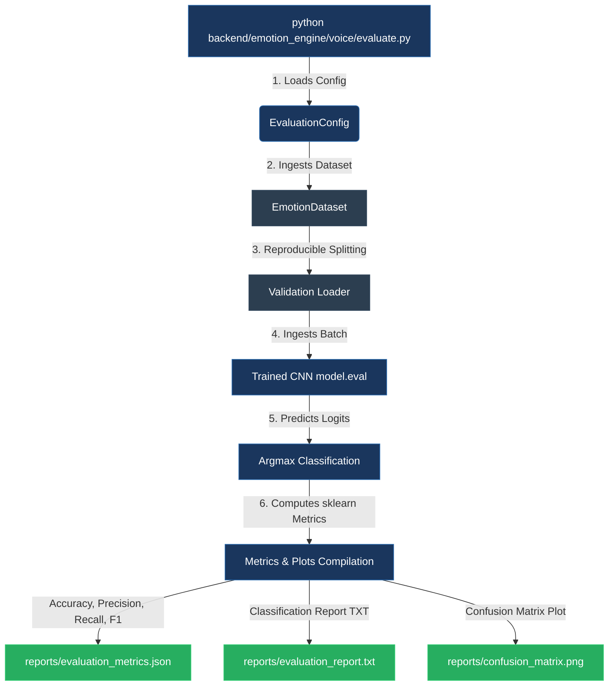

# Model Evaluation Pipeline Design: Voice Emotion Recognition

This document details the engineering design, execution parameters, and statistical rationale behind the evaluation pipeline of the Voice Emotion Recognition Engine.

---

## 1. Overall Evaluation Workflow

The evaluation pipeline isolates the validation partition of the preprocessed database and computes standard multi-class evaluation scores to judge model performance objectively.



---

## 2. Module Architecture

The pipeline consists of the following public classes and modules:

*   **`EvaluationConfig` (Immutable Dataclass):** Stores absolute paths to model file (`best_voice_model.pth`), datasets indices (`feature_index.csv`), features directory, and output reports directory. It enforces valid validation split parameters ($0.0 < s < 1.0$) upon initialization.
*   **`load_trained_model()`:** Recreates the same underlying configuration (`VoiceModelConfig`) used during training, constructs `EmotionCNN`, loads the saved weight state dictionary onto the target hardware device (CUDA or CPU), and sets the model to `eval` mode.
*   **`generate_confusion_matrix_plot()`:** Compiles and saves a visual confusion matrix with class counts and colorbars.
*   **`run_evaluation()`:** Orchestrates data partitioning, runs batch inference, computes metric averages, and serializes outputs.

---

## 3. Metrics Rationale: Macro Averaging

To assess classification accuracy across all emotion categories, the pipeline implements **Macro Averaging** for precision, recall, and F1 metrics:
- **Calculation:** Computes metrics (Precision, Recall, F1) independently for each emotion category first, then calculates the arithmetic mean of those individual scores.
- **Why Macro Averaged?** Voice datasets (such as RAVDESS or CREMA-D) are often imbalanced. For example, expressions of *disgust* or *surprised* may be much rarer than *neutral* or *happy* samples. 
  - If we used *Micro Averaging* or *Weighted Averaging*, overall scores would be dominated by performance on the most frequent classes. A model that performs poorly on rarer emotions would still show misleadingly high performance.
  - *Macro Averaging* treats all classes equally, penalizing the model if it fails to classify rarer emotions. This serves as a reliable metric for multi-class voice classification pipelines.

---

## 4. Output Files and Explanations

Following a successful evaluation execution, three distinct files are written under the `reports/` folder:

1.  **`reports/evaluation_metrics.json`:**
    A structured dictionary containing overall scores (accuracy, macro precision, macro recall, and macro F1-score) to facilitate automated parsing or CI/CD pipelines.
2.  **`reports/evaluation_report.txt`:**
    A human-readable classification report detailing precision, recall, f1-score, and support counts for each individual class, alongside generation timestamps.
3.  **`reports/confusion_matrix.png`:**
    A matplotlib-generated plot displaying counts of True Labels vs. Predicted Labels. Grid values are printed directly within matrix cells, showing which emotions are commonly confused (e.g. *angry* vs. *fearful*).

---

## 5. Execution Guide

Run the pipeline from the project root directory using the active environment:

```powershell
python backend/emotion_engine/voice/evaluate.py
```

No parameters are required. The script will automatically locate files using default paths relative to the project root, execute inference, print summary stats to the terminal, and save the reports.
