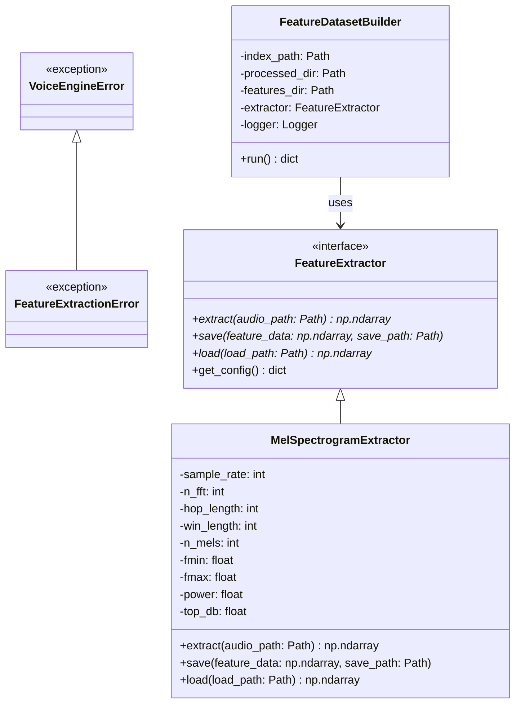

# Voice Emotion Engine Feature Extraction Design

This document details the engineering design, architectural decisions, and educational rationale behind the offline feature extraction module of the Voice Emotion Engine.

---

## 1. Why Feature Extraction Exists

In speech processing and emotion recognition, raw digital audio waveforms (represented as 1D amplitude arrays over time) are rarely fed directly into deep learning models. Instead, we compute intermediate time-frequency representations. Feature extraction serves several crucial purposes:

*   **Acoustic Information Compression**: A 3-second audio signal at 16 kHz contains 48,000 raw amplitude values. Most of these individual values are highly redundant and sensitive to phase variations. Extracting features collapses this high-dimensional signal into a compact representation, discarding phase information that is mostly imperceptible to humans and irrelevant to emotion recognition.
*   **Time-Frequency Representation**: Humans do not perceive speech as a series of raw amplitudes over time. Instead, our ears act as biological spectrum analyzers, decomposing sound into different frequency bands. By performing a Short-Time Fourier Transform (STFT), we transform the 1D waveform into a 2D representation (time vs. frequency) that reveals how the spectral energy of the voice shifts over time. This exposes formant transitions, harmonics, and pitch contours which carry strong emotional cues.
*   **Translation to Visual Patterns**: Converting audio into a 2D spectrogram allows us to treat speech emotion recognition as a computer vision problem. We can leverage highly successful 2D Convolutional Neural Network (CNN) architectures (such as ResNet, VGG, or custom CNNs) to detect local time-frequency patterns like pitch changes, vibrato, and energy rises.

---

## 2. Why Mel Spectrograms Were Selected

For speech emotion recognition, we select **Mel Spectrograms** as our primary feature representation rather than standard linear spectrograms or Mel-Frequency Cepstral Coefficients (MFCCs). The reasoning is based on both human psychoacoustics and machine learning compatibility:

*   **Logarithmic Pitch Scale (The Mel Scale)**: Human hearing is non-linear. We are much more sensitive to small differences in low frequencies (below 1000 Hz) than in high frequencies. The Mel scale is a logarithmic transformation of the physical frequency scale (Hz) designed to mimic this human perception:
    $$m = 2595 \log_{10}\left(1 + \frac{f}{700}\right)$$
    By grouping physical frequency bins into Mel bands, we allocate more resolution to lower frequency ranges (where vocal formants and pitch are concentrated) and less to high frequency ranges (where noise resides).
*   **Logarithmic Amplitude Scale (Decibel Scaling)**: Similarly, human perception of volume is logarithmic. A change in sound pressure from 0.1 to 0.2 feels much more significant than a change from 0.8 to 0.9. Converting power/amplitude spectrograms to the decibel (dB) scale ($10 \log_{10}(P)$) ensures that the relative volume changes correspond to human perception and stabilizes gradients during backpropagation.
*   **Comparison with Linear Spectrograms**: Linear spectrograms preserve equal resolution across all frequencies. This wastes parameters on high-frequency noise regions and dilutes the features corresponding to vocal pitches and harmonics.
*   **Comparison with MFCCs**: MFCCs perform a Discrete Cosine Transform (DCT) on log-mel spectra to decorrelate the bins, yielding a highly compressed representation. While MFCCs were essential for traditional GMM-HMM speech systems, they discard spatial relations between frequency bands. CNNs do not need decorrelated features and thrive on the raw spatial 2D topography of the Mel Spectrogram.

---

## 3. Connection from Preprocessing to CNN Training

The feature extraction module acts as the bridge connecting the standardized WAV output of Module 2 to the input layer of the Convolutional Neural Network (CNN) in downstream stages:

```
+------------------+     +--------------------------+     +-------------------------+
|  Preprocessed    |     |  Mel Spectrogram         |     |  Convolutional Neural   |
|  Audio (1D)      | --> |  Extraction (2D)         | --> |  Network (CNN)          |
|  48,000 samples  |     |  Shape: 128 x 94 frames  |     |  Input Tensor           |
+------------------+     +--------------------------+     +-------------------------+
```

*   **Fixed Dimension Guarantees**: Because the preprocessor standardizes all audio files to exactly 3.0 seconds (48,000 samples) at 16 kHz, every Mel spectrogram computed with the same parameters (e.g., $n_{fft}=1024, hop\_length=512$) will yield a matrix of the exact same size:
    $$\text{Time Steps} = \left\lfloor \frac{\text{Samples} - n_{fft}}{hop\_length} \right\rfloor + 1 = \left\lfloor \frac{48000 - 1024}{512} \right\rfloor + 1 = 92 + 1 = 93 \text{ frames}$$
    (Depending on center padding, it will be exactly 94 frames).
    This mathematical consistency guarantees that every extracted feature is a $128 \times 94$ matrix, allowing PyTorch to batch them into a `(batch_size, 1, 128, 94)` tensor without padding or masking.
*   **Standardized Energy Levels**: Since the amplitude was normalized to a peak of 1.0, the resulting spectrogram decibel levels are centered around similar bounds, preventing loud or quiet speakers from skewing the model's weight updates.

---

## 4. Software Architecture

Following the design philosophy of `preprocess.py`, the feature extraction module is built with clean architecture, modularity, and extensibility in mind.

### Class Diagram



### Component Details

1.  **`FeatureExtractionError` Hierarchy**: Custom exceptions to isolate feature computation issues, filesystem errors, or configuration mismatches.
2.  **`FeatureExtractor` (Abstract Base Class)**: Establishes a standard contract for any future audio representations. Any subclass (e.g. MFCC, Chroma) must implement `extract`, `save`, and `load` methods. This ensures the rest of the training system is decoupled from specific feature types.
3.  **`MelSpectrogramExtractor`**: Contains the mathematical implementation of log-Mel spectrogram extraction using the `librosa` library. In accordance with the project guidelines:
    *   `extract()` is side-effect free: it computes and returns the raw features without saving anything.
    *   `save()` and `load()` handle binary serialization using NumPy's highly efficient `.npy` format.
4.  **`FeatureDatasetBuilder`**: Manages the dataset loop:
    *   Reads `dataset_index.csv` to find each raw file's metadata.
    *   Resolves the corresponding preprocessed WAV path under `datasets/processed/`.
    *   Coordinates the extractor, saves `.npy` outputs preserving directory structures, and logs statistics.
    *   Produces metadata (`feature_index.csv`, `feature_config.json`, `feature_report.csv`).
