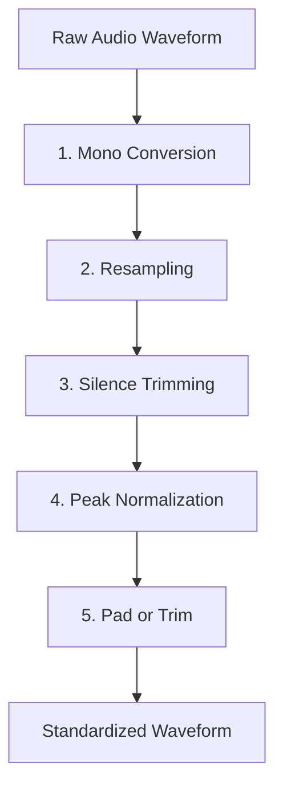

# Voice Emotion Engine Preprocessing Engineering Report

This document provides a comprehensive technical reference for the offline preprocessing pipeline of the Voice Emotion Engine. It is intended for developers joining the project to quickly understand the pipeline's purpose, design decisions, execution results, and connection to downstream machine learning modules.

---

## 1. Purpose

The raw audio files representing human speech contain varying formats, sampling frequencies, amplitude ranges, and levels of silence. Passing these directly to a deep learning classifier (such as a Convolutional Neural Network or CNN) introduces computational bottlenecks, data shape mismatches, and acoustic noises.

The offline voice preprocessing pipeline exists to transform heterogeneous, raw audio datasets into a standardized, clean, and uniform binary state. This is a critical prerequisite for two main processes:

1. **Feature Extraction**: Deep learning models for speech emotion recognition typically do not classify raw audio directly. Instead, they operate on time-frequency representations such as Mel-spectrograms or Mel-Frequency Cepstral Coefficients (MFCCs). Generating consistent feature matrices from audio requires the source waveforms to have the exact same duration and sampling rate.
2. **CNN Training and Batching**: Modern neural networks are trained using parallel mini-batching on GPUs. To construct a batch (tensor) of shape `(batch_size, channels, height, width)`, every individual sample in the batch must have identical shapes. By standardizing the audio sample rate and duration, we ensure that every extracted spectrogram has the exact same dimensions (e.g., $128 \times 300$). This allows PyTorch to easily batch waveforms together without complex dynamic padding, masking, or extra padding tokens that dilute gradients.

---

## 2. Architecture

The preprocessing module is decoupled from the directory scanning and metadata extraction to maintain clear boundaries. The codebase is organized as follows:

```
backend/
└── emotion_engine/
    └── voice/
        ├── loader.py             # Dataset loader and metadata parsing
        ├── preprocess.py         # DSP pipeline & dataset orchestration
        └── test_preprocess.py    # Unit tests for preprocessing
```

### Components and Core Responsibilities

*   **[preprocess.py](file:///C:/Users/Dell/Desktop/Emotion%20App%20-%20Ashwin/backend/emotion_engine/voice/preprocess.py)**: The core entry point containing the digital signal processing (DSP) operations, normalizers, and the loop manager that coordinates processing all samples.
*   **[AudioPreprocessor](file:///C:/Users/Dell/Desktop/Emotion%20App%20-%20Ashwin/backend/emotion_engine/voice/preprocess.py#L70)**: Orchestrates the sequential pipeline operations (mono conversion, resampling, silence trimming, amplitude normalization, and padding/trimming) on individual NumPy waveform arrays.
*   **[DatasetPreprocessor](file:///C:/Users/Dell/Desktop/Emotion%20App%20-%20Ashwin/backend/emotion_engine/voice/preprocess.py#L214)**: Reads the master dataset index, schedules processing for each file, preserves the directory hierarchy within the output folder, saves the output WAV files, stores learning examples, and generates reports.
*   **[preprocessing_config.json](file:///C:/Users/Dell/Desktop/Emotion%20App%20-%20Ashwin/datasets/processed/metadata/preprocessing_config.json)**: A JSON metadata file that records the hyperparameter configuration (sample rate, target duration, threshold, etc.) of the preprocessing run, serving as the contract for future modules.
*   **[preprocessing_report.csv](file:///C:/Users/Dell/Desktop/Emotion%20App%20-%20Ashwin/datasets/processed/metadata/preprocessing_report.csv)**: A detailed tracking sheet documenting the input path, output path, original properties (sample rate, duration), actions taken (stereo conversion, padding, trimming), and execution status of every single audio file.
*   **[preprocessing_design.md](file:///C:/Users/Dell/Desktop/Emotion%20App%20-%20Ashwin/docs/preprocessing_design.md)**: The original system design documentation detailing the signal processing rationale, order of operations, and DSP mathematical parameters.

---

## 3. Complete Processing Pipeline

The preprocessor executes a sequence of 5 distinct operations in a mathematically and computationally optimal order. Altering this sequence will corrupt the output data, introduce acoustic noise, or cause dimensions to vary.



### 1. Mono Conversion
*   **What it does**: Detects if the audio file has multiple channels and averages them into a single-channel (1D) waveform array.
*   **Why it exists**: Voice datasets recorded in stereo contain redundant signals between channels. Models only need the speech frequency characteristics, not spatial sound.
*   **Why its position matters**: Converting to mono must be the first step. By reducing the channels from 2 to 1, we discard 50% of the sample points immediately. This halves the execution time and CPU memory footprint for all subsequent steps (resampling, trimming, normalization, and padding).
*   **Inputs**: Waveform array of shape `(channels, samples)` or `(samples,)`.
*   **Outputs**: Waveform array of shape `(samples,)` and a boolean flag indicating if conversion occurred.

### 2. Resampling
*   **What it does**: Changes the sampling frequency of the audio waveform from its native rate (e.g., 48 kHz) to the target rate (16 kHz) using bandlimited interpolation.
*   **Why it exists**: Raw voice files come from different sources with varying sampling frequencies. Speech models require a consistent sample rate to build consistent spectrogram grids.
*   **Why its position matters**: Must occur before silence trimming and padding. Silence-detection thresholds, time duration calculations, and target sample counts (e.g., $3 \text{ seconds} \times 16000 \text{ Hz} = 48000 \text{ samples}$) are sample-rate dependent. Resampling first ensures that speech windows are evaluated consistently.
*   **Inputs**: Waveform array at native sample rate.
*   **Outputs**: Waveform array at 16000 Hz.

### 3. Silence Trimming
*   **What it does**: Computes the root-mean-square (RMS) energy across the audio signal and trims away leading and trailing frames that fall below a configurable threshold (e.g., 30 dB relative to the peak).
*   **Why it exists**: Audio recordings often contain "dead air" at the beginning and end before the speaker begins talking or after they finish. This silence is useless for emotion classification and wastes model capacity.
*   **Why its position matters**: Trimming must happen *before* amplitude normalization (so background noise in silent segments does not bias the peak amplitude calculation) and *before* padding (otherwise, we would trim away the padding zeros).
*   **Inputs**: Resampled waveform.
*   **Outputs**: Trimmed waveform and a boolean flag indicating if trimming occurred.

### 4. Peak Normalization
*   **What it does**: Identifies the absolute maximum amplitude value of the waveform ($x_{max} = \max(|x|)$) and scales the entire waveform linearly by a factor of $\frac{\text{target\_peak}}{x_{max}}$ (typically targeting 1.0).
*   **Why it exists**: Audio files are recorded with different microphones, distances, and input gains, leading to soft and loud recordings. Normalization standardizes loudness without compressing the dynamic range.
*   **Why its position matters**: Must happen *after* silence trimming (so the peak calculation represents the actual speech signal rather than background clicks or noise in silences) and *before* padding (so the padded zero values remain exactly `0.0` and do not get scaled or distorted).
*   **Inputs**: Active speech waveform segment.
*   **Outputs**: Scaled active speech waveform segment.

### 5. Pad / Trim
*   **What it does**: Standardizes the waveform length. If the active waveform is shorter than 3.0 seconds, it pads it with trailing zeros (silence) to reach exactly 48,000 samples. If it is longer, it truncates the waveform at exactly 48,000 samples.
*   **Why it exists**: This enforces the constant-length constraint required for downstream tensor batching.
*   **Why its position matters**: This is the final step. Doing it earlier would result in subsequent operations (like resampling or silence trimming) altering the duration and violating the uniform sample length constraint.
*   **Inputs**: Normalized waveform segment.
*   **Outputs**: Standardized waveform of exactly 48,000 samples.

---

## 4. Dataset Summary

The preprocessing pipeline was run on the merged corpus of two widely-cited emotional speech databases:

1. **RAVDESS**: Ryerson Audio-Visual Database of Emotional Speech and Song.
2. **CREMA-D**: Crowd-sourced Emotional Multimodal Actors Dataset.

### Dataset Overview Table

| Metric | RAVDESS | CREMA-D | Unified Processed State |
| :--- | :--- | :--- | :--- |
| **Raw Folder Path** | `datasets/raw/RAVDESS/` | `datasets/raw/CREMA-D/` | `datasets/processed/` |
| **Number of Files** | 2,880 | 7,442 | **10,322** (all successfully processed) |
| **Original Sample Rate**| 48,000 Hz | 16,000 Hz | **16,000 Hz** (Uniform) |
| **Original Duration** | 3.0 to 5.0 seconds | 2.0 to 4.0 seconds | **3.0 seconds** (48,000 samples, Uniform) |
| **Speaker Distribution** | 24 unique actors (12 M / 12 F)| 91 unique actors (48 M / 43 F)| 115 unique speakers |
| **Vocal Modality** | Speech and Song | Speech only | Standardized Speech/Audio |
| **Emotion Classes** | 8 emotions | 6 emotions | Neutral, Calm\*, Happy, Sad, Angry, Fearful, Disgust, Surprised\* <br>\*(Calm and Surprised only present in RAVDESS) |

### Directory Structure of Preprocessed Outputs

To keep the raw datasets untouched, the pipeline replicates the structural organization of raw folders inside `datasets/processed/`:

```
datasets/
├── raw/                      # Raw immutable source datasets
│   ├── CREMA-D/              # 7,442 WAV files
│   └── RAVDESS/              # Actor_01 to Actor_24 containing WAV files
└── processed/                # Standardized output datasets
    ├── CREMA-D/              # 7,442 preprocessed WAV files
    ├── RAVDESS/              # Actor_01 to Actor_24 containing preprocessed WAV files
    └── metadata/             # Execution logs and config contracts
        ├── preprocessing_config.json
        └── preprocessing_report.csv
```

---

## 5. Processing Statistics

The completed run processed **10,322** files in **143.18 seconds** (approx. 72 files per second).

```
- Number of processed files: 10322
- Number of skipped files: 0
- Final sample rate: 16000 Hz
- Final clip duration: 3.0 seconds
- Number of stereo files converted: 10
- Number of files trimmed (silence): 5026
- Number of files padded: 9226
- Number of files trimmed (duration): 1096
```

### Analysis of the Statistics

*   **0 Skipped Files**: Confirms that all audio files were valid WAV containers and did not trigger corruption exceptions (such as [AudioLoadError](file:///C:/Users/Dell/Desktop/Emotion%20App%20-%20Ashwin/backend/emotion_engine/voice/loader.py#L19)) during librosa decoding.
*   **10 Stereo Files Converted**: Confirms that the stereo conversion module successfully caught and converted the few multichannel recordings present in the directories, safeguarding the downstream features from dimension conflicts.
*   **5,026 Silence Trims**: Roughly 48.7% of the files had silent intervals (leading or trailing) exceeding the 30 dB threshold. Trimming these removed non-speech buffers, cleaning up inputs.
*   **9,226 Files Padded vs. 1,096 Files Trimmed (duration)**: The vast majority of raw clips (89.4%) were shorter than 3.0 seconds after silence trimming, requiring zero-padding to meet the target duration. Only a small fraction (10.6%) were longer than 3.0 seconds and had to be truncated. This confirms that 3.0 seconds is a highly appropriate length, balancing information preservation with minimal truncation.

---

## 6. Generated Outputs

The pipeline generates five main outputs, each designed to support upcoming engineering tasks:

1. **[dataset_index.csv](file:///C:/Users/Dell/Desktop/Emotion%20App%20-%20Ashwin/datasets/metadata/dataset_index.csv)**:
   * *Role*: Generated by the loader. Contains paths, datasets, emotions, and speaker IDs.
   * *Future Use*: Connects raw audio to processed outputs, keeping database queries separated from signal processing.
2. **Processed Dataset Files (`datasets/processed/`)**:
   * *Role*: Standardized 16 kHz, 3.0s mono audio files.
   * *Future Use*: Serves as the clean data source for feature extraction and training.
3. **[preprocessing_config.json](file:///C:/Users/Dell/Desktop/Emotion%20App%20-%20Ashwin/datasets/processed/metadata/preprocessing_config.json)**:
   * *Role*: Saves parameters like sample rate and duration.
   * *Future Use*: Used by the feature extractor to set the correct input size and parameters dynamically.
4. **[preprocessing_report.csv](file:///C:/Users/Dell/Desktop/Emotion%20App%20-%20Ashwin/datasets/processed/metadata/preprocessing_report.csv)**:
   * *Role*: Documents the exact metrics and steps taken for each processed file.
   * *Future Use*: Used to audit issues (e.g., if a file sounds corrupted, we can check its original sample rate or check if it was heavily truncated).
5. **[preprocessing_examples](file:///C:/Users/Dell/Desktop/Emotion%20App%20-%20Ashwin/docs/preprocessing_examples)**:
   * *Role*: Stores one raw vs. processed WAV pair for each emotion.
   * *Future Use*: Allows developers to manually inspect and verify processing quality (e.g., checking if silence trimming worked as expected).

---

## 7. Design Decisions

The design of this preprocessing system is based on several key engineering principles:

*   **Offline vs. Online Preprocessing**: Running DSP tasks like resampling (bandlimited interpolation) and silence trimming on-the-fly during training is CPU-heavy. Doing it offline once saves GPU resources, speeds up training epochs, and creates a stable dataset that is easier to inspect.
*   **Separation of Concerns across Modules**: [loader.py](file:///C:/Users/Dell/Desktop/Emotion%20App%20-%20Ashwin/backend/emotion_engine/voice/loader.py) handles metadata, parsing, and directory scanning, while [preprocess.py](file:///C:/Users/Dell/Desktop/Emotion%20App%20-%20Ashwin/backend/emotion_engine/voice/preprocess.py) focuses purely on DSP. This makes the code modular, easier to test, and adaptable to other datasets.
*   **Reusing the Index File**: The loader saves a validated CSV index of raw files. The preprocessor uses this as its single source of truth, avoiding redundant folder scanning and regex pattern matching.
*   **Choosing 16 kHz as the Target Sample Rate**: Human speech frequencies are mostly under 8 kHz. Resampling to 16 kHz covers the Nyquist frequency for speech, reducing file size by over 66% compared to RAVDESS's native 48 kHz without losing emotional speech cues.
*   **Choosing Peak Normalization**: Peak normalization scales the amplitude linearly. Unlike dynamic range compression, it preserves the relative loudness difference between soft speech (e.g., sadness) and loud speech (e.g., anger), which is a key feature for emotion detection.
*   **Keeping Raw Datasets Immutable**: Raw files are never modified or overwritten. Replicating the directory layout in a separate `processed` directory prevents data loss and makes it easy to experiment with different preprocessing settings.

---

## 8. Current Project Pipeline

Below is the workflow of the Voice Emotion Engine from raw data ingestion to the standardized output state:

```
[Raw Datasets: RAVDESS & CREMA-D] (WAV files in various folders)
              │
              ▼
    [loader.py: scan_dataset]     (Scans files, parses filename metadata)
              │
              ▼
    [loader.py: load_sample]      (Instantiates lazy-loaded VoiceSample objects)
              │
              ▼
       [dataset_index.csv]        (Writes paths, emotions, speaker IDs to disk)
              │
              ▼
   [preprocess.py: run loop]      (Loads raw WAV files using the dataset_index.csv)
              │
              ▼
      [AudioPreprocessor]         (Executes: Mono -> Resample -> Trim -> Normalize -> Pad/Trim)
              │
              ▼
[Processed Datasets & Metadata]   (Writes WAVs to datasets/processed/, creates logs)
```

*   **Raw Datasets**: Immutable directory hierarchy containing raw audio clips.
*   **[loader.py](file:///C:/Users/Dell/Desktop/Emotion%20App%20-%20Ashwin/backend/emotion_engine/voice/loader.py)**: Scans directories, extracts labels from filenames, and generates the master index.
*   **[dataset_index.csv](file:///C:/Users/Dell/Desktop/Emotion%20App%20-%20Ashwin/datasets/metadata/dataset_index.csv)**: A clean mapping of files, datasets, emotions, and speakers.
*   **[preprocess.py](file:///C:/Users/Dell/Desktop/Emotion%20App%20-%20Ashwin/backend/emotion_engine/voice/preprocess.py)**: The DSP pipeline that processes the raw waveforms based on the index.
*   **Processed Datasets & Metadata**: The resulting standardized audio files and report files.

---

## 9. Current Project Status

The codebase is structured in a logical flow. Below is the progress of each module:

```
┌──────────────────────────────────────────────────────────┐
│ Completed Modules                                        │
├─────────────────────────────────────┬────────────────────┤
│ Ingestion & Directory Parsing       │ loader.py (100%)   │
│ Offline Audio Preprocessing         │ preprocess.py (100%)│
│ DSP Testing Suite                   │ test_preprocess.py │
└─────────────────────────────────────┴────────────────────┘
                               │
                               ▼
┌──────────────────────────────────────────────────────────┐
│ Pending Modules                                          │
├──────────────────────────────────────────────────────────┤
│ Module 3: Feature Extraction (Spectrogram / MFCC)        │
│ Module 4: PyTorch Dataset & DataLoader Infrastructure    │
│ Module 5: CNN Architecture Design & Training Pipeline    │
│ Module 6: Evaluation & Multimodal Inference Engine       │
└──────────────────────────────────────────────────────────┘
```

*   **Completed Modules**: Datasets are indexed and preprocessed. Unit tests for the DSP pipeline are passing.
*   **Pending Modules**: Feature extraction, PyTorch dataset loaders, and model training.
*   **Next Logical Step**: **Module 3: Feature Extraction**. Using the preprocessed 16 kHz mono waveforms to extract Mel-spectrograms or MFCCs, and saving them as structured features ready for PyTorch.

---

## 10. Lessons Learned

*   **Separation of Concerns**: Separating filename metadata parsing ([loader.py](file:///C:/Users/Dell/Desktop/Emotion%20App%20-%20Ashwin/backend/emotion_engine/voice/loader.py)) from digital signal processing ([preprocess.py](file:///C:/Users/Dell/Desktop/Emotion%20App%20-%20Ashwin/backend/emotion_engine/voice/preprocess.py)) makes the modules clean and easier to maintain.
*   **Lazy Loading**: Loading thousands of raw audio files into RAM at once causes memory errors. Defining a [VoiceSample](file:///C:/Users/Dell/Desktop/Emotion%20App%20-%20Ashwin/backend/emotion_engine/voice/loader.py#L50) class that parses metadata immediately but defers loading the waveform array until it is explicitly requested is a key practice for resource management.
*   **Mono vs. Stereo**: Stereo files double the memory footprint and CPU load for subsequent DSP operations. Converting to mono early saves computational power.
*   **The Math of Sample Rates and Nyquist Frequency**: Resampling down to 16 kHz reduces the data size by 66.7% while keeping all necessary vocal frequencies for speech emotion classification.
*   **Linear Scaling via Peak Normalization**: Using linear scaling instead of compression preserves the loudness dynamics (like whisper vs. scream) that help models identify different emotions.
*   **Padding and Trimming**: Standardizing the sample duration ensures consistent feature dimensions, which is essential for batch training.
*   **Offline Preprocessing**: Preparing data ahead of training avoids CPU bottlenecks, ensuring the GPU does not wait for data during model training.

---

## 11. Future Work

Below is a roadmap of how the preprocessed outputs will integrate with the remaining modules of the Voice Emotion Engine:

### 1. Feature Extraction (Module 3)
*   **Integration**: The feature extractor will read the standardized WAV files from `datasets/processed/` using [preprocessing_config.json](file:///C:/Users/Dell/Desktop/Emotion%20App%20-%20Ashwin/datasets/processed/metadata/preprocessing_config.json) parameters.
*   **Role**: Waveforms will be converted to 2D log-Mel spectrograms or MFCCs using Short-Time Fourier Transforms (STFT). Since the duration is exactly 3.0s and the sample rate is 16 kHz, every resulting spectrogram will have identical dimensions.

### 2. PyTorch Dataset & DataLoader (Module 4)
*   **Integration**: A custom PyTorch `Dataset` class will load the extracted feature files.
*   **Role**: Because all features have identical sizes, the PyTorch `DataLoader` can batch them directly without dynamic padding.

### 3. CNN Architecture & Training (Module 5)
*   **Integration**: The neural network will take the fixed-size 2D features as inputs.
*   **Role**: A Convolutional Neural Network (CNN) will be trained using the standardized features. Since silent regions and loudness differences have been cleaned up, the model can focus purely on learning emotional features from speech.

### 4. Multimodal Inference (Module 6)
*   **Integration**: Real-time voice inputs will run through the same [AudioPreprocessor](file:///C:/Users/Dell/Desktop/Emotion%20App%20-%20Ashwin/backend/emotion_engine/voice/preprocess.py#L70) pipeline.
*   **Role**: Real-time microphone audio will be processed in memory using the same settings (16 kHz, mono, 3.0s duration, peak normalized) before classification, ensuring consistency between training and inference.
