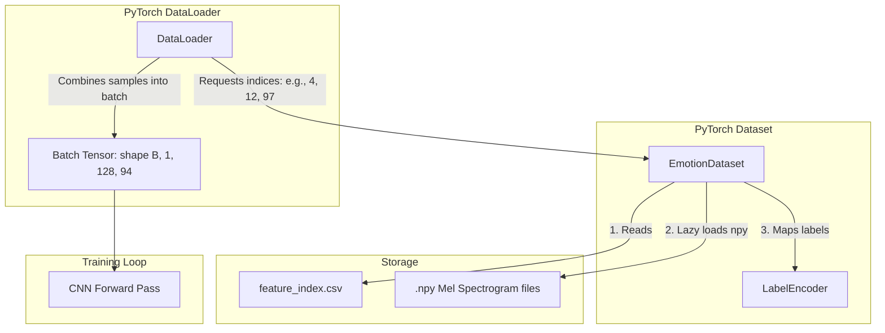

# PyTorch Dataset Design Document: Voice Emotion Classification

This document outlines the architecture, rationale, and functionality of the PyTorch Dataset component in the voice emotion classification pipeline.

---

## 1. Why the PyTorch Dataset Exists

In deep learning pipelines, data preprocessing and feature extraction are computationally heavy and distinct from the model training process. 
The PyTorch `Dataset` (`torch.utils.data.Dataset`) acts as a structured bridge between raw files saved on disk and PyTorch's tensor-based computation engine.

Its existence is critical for the following reasons:
- **Separation of Concerns:** It isolates the logic of file storage, format conversion (e.g., loading `.npy` Mel spectrograms), and label mapping from the model architecture and training loops.
- **Lazy Loading (Memory Efficiency):** Instead of loading the entire corpus (thousands of high-dimensional spectrographic NumPy arrays) into system RAM, the Dataset loads and processes samples on demand when queried by index. This prevents Out-Of-Memory (OOM) failures.
- **Standardized Interface:** It implements the standard Python sequence protocol (`__len__` and `__getitem__`), allowing PyTorch's native data utilities to query it uniformly.

---

## 2. Difference Between Dataset and DataLoader

While they work together, `Dataset` and `DataLoader` have entirely distinct responsibilities in a training pipeline:

| Characteristic | `Dataset` | `DataLoader` |
| :--- | :--- | :--- |
| **Primary Goal** | Define **what** a single sample is and **how** it is fetched. | Define **how** batches of samples are constructed and streamed. |
| **Inherits From** | `torch.utils.data.Dataset` | `torch.utils.data.DataLoader` (instantiated directly) |
| **Indexing** | Retrieves a single item at index `i` (returns `(features, label)`). | Aggregates multiple single items into batches (returns `(batch_features, batch_labels)`). |
| **Key Operations** | File I/O, parsing metadata, reshaping individual tensors, label encoding. | Batching, shuffling, multi-process data loading (`num_workers`), pin memory, collating samples. |

---

## 3. Why Tensors are Used Instead of NumPy Arrays

Although features are extracted and saved on disk as NumPy arrays (`.npy`), they must be converted to `torch.Tensor` objects before entering the neural network:

1. **Hardware Acceleration (GPU/TPU Execution):** NumPy arrays are strictly bound to system CPU memory. PyTorch Tensors can be seamlessly moved to GPU memory (`cuda`) or other accelerators for massively parallelized matrix multiplication.
2. **Computational Graph & Automatic Differentiation (`Autograd`):** Neural network training relies on backpropagation. PyTorch tensors can track operations in a computational graph to calculate gradients automatically (`loss.backward()`). NumPy lacks this ability.
3. **Memory Layout and Optimization:** PyTorch tensors are optimized for contiguous memory blocks that match deep learning library layouts (like cuDNN) for convolution operations.

---

## 4. Why Labels are Encoded as Integers

Categorical string labels (e.g., `'happy'`, `'neutral'`, `'sad'`) must be converted to integer indexes (e.g., `2`, `0`, `3`) because of loss function mathematical formulations:

- **Mathematical Target Representation:** Loss functions such as Cross-Entropy Loss (`torch.nn.CrossEntropyLoss`) calculate error metrics by comparing log-probabilities predicted by a model (an array of size $C$, where $C$ is the number of classes) against the ground truth target.
- **Index-based Loss Calculation:** Rather than comparing strings or requiring one-hot vectors, PyTorch's optimized Cross-Entropy implementation expects the ground-truth target to be a 1D tensor of class index integers ($0 \le \text{index} < C$). This is highly efficient and avoids the sparse memory overhead of one-hot encoded tensors.

---

## 5. How this Module Prepares Data for CNN Training

The `EmotionDataset` shapes the input mel-spectrogram arrays specifically to comply with the architectural requirements of a Convolutional Neural Network (CNN):

- **The Channel Dimension ($C_{in}$):** 
  A standard Mel spectrogram is saved as a 2D array of shape `(n_mels, time_steps)` — in our case, `(128, 94)`. 
  However, standard 2D CNN layers (`torch.nn.Conv2d`) expect a 4D input batch shape of:
  $$\text{Shape: } (B, C_{in}, H, W)$$
  where:
  - $B$ is the batch size.
  - $C_{in}$ is the number of input channels (like 3 for RGB images, or 1 for grayscale/spectrograms).
  - $H$ is the height (frequency bins, `128`).
  - $W$ is the width (temporal frames, `94`).
  
  By executing `feature_tensor.unsqueeze(0)` on each retrieved sample, the dataset produces an individual sample shape of `(1, 128, 94)`.
  When the `DataLoader` collates $B$ samples together, it automatically stacks them along a new batch dimension, yielding a perfectly formatted tensor of shape `(B, 1, 128, 94)` ready for 2D convolutions.
