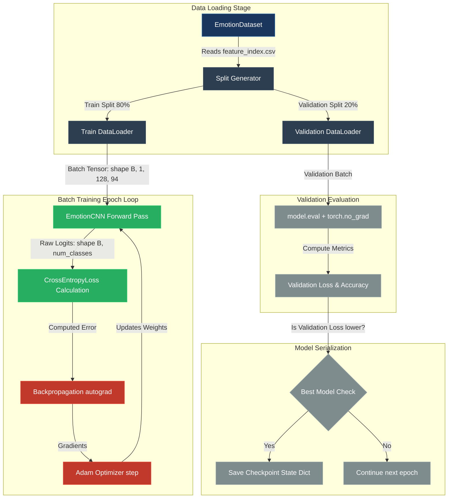

# Training Pipeline Design: Voice Emotion Recognition Engine

This document details the engineering design, architectural components, and mathematical rationale behind the training and validation pipeline of the Voice Emotion Recognition Engine.

---

## 1. Overall Training Workflow

The training pipeline orchestrates the ingestion of raw features, gradient propagation, optimizer weight adjustments, validation assessments, and model serialization. 

---

## 2. Key Mathematical & Architectural Components

### 2.1 Dataset Partitioning & Splits
- **Strategy:** Standard training/validation split (default 80/20 ratio).
- **Implementation:** Uses PyTorch's native `torch.utils.data.random_split`.
- **Reproducibility:** A fixed seed is provided to the split `Generator` (`torch.Generator().manual_seed(seed)`). This ensures the partition is identical across runs, protecting validation integrity and avoiding data leakage.

### 2.2 PyTorch DataLoaders
- **Responsibility:** Load batch tensors, manage memory buffers, and run background worker processes.
- **Train Loader:** `shuffle=True` is enabled. Shuffling samples in each epoch prevents the optimizer from memorizing sequential sample ordering, enforcing generalization.
- **Validation Loader:** `shuffle=False`. Evaluates the static validation subset sequentially to keep metrics comparable.
- **Performance Configuration:** Leverages `pin_memory` on CUDA runs for faster CPU-to-GPU data transfers and features zero-overhead memory pin mappings.

### 2.3 Forward Pass & CrossEntropyLoss
- **Forward Pass:** Batch shapes of shape `(B, 1, 128, 94)` are fed into `EmotionCNN` to output unnormalized `(B, num_classes)` logits.
- **Cross-Entropy Loss:** Combines Log-Softmax and negative log-likelihood (NLL) calculation:
  $$\mathcal{L} = -\frac{1}{B} \sum_{i=1}^B \log \left( \frac{e^{s_{i, y_i}}}{\sum_{j} e^{s_{i, j}}} \right)$$
  Where $s$ is the logit scores, and $y_i$ is the target integer label index. Passing raw logits to `nn.CrossEntropyLoss` is numerically stable since it uses the log-sum-exp stabilization trick, preventing overflows.

### 2.4 Backpropagation & Adam Optimizer
- **Backpropagation:** Computes gradient derivatives of loss with respect to all trainable parameters ($\frac{\partial \mathcal{L}}{\partial W}$) by traversing the computational graph created dynamically during the forward pass.
- **Adam Optimizer:** An adaptive learning rate algorithm combining momentum (first moment) and scaling based on square gradient averages (second moment):
  $$W_{t+1} = W_t - \frac{\eta}{\sqrt{\hat{v}_t} + \epsilon} \hat{m}_t$$
  Where:
  - $\eta$ is the learning rate.
  - $\hat{m}_t$ is the bias-corrected first moment (running average of gradients).
  - $\hat{v}_t$ is the bias-corrected second moment (running average of squared gradients).
  - $\epsilon$ is a small smoothing constant ($10^{-8}$) to avoid division by zero.
  - It uses a L2 regularization penalty (`weight_decay` parameter) to prevent weights from growing excessively.

### 2.5 Training vs. Evaluation Modes
- **`model.train()`:** Activates training-specific behaviors like:
  - **Dropout:** Randomly deactivates nodes to force the learning of redundant representations.
  - **Batch Normalization:** Uses running batch statistics to compute mean and variance.
- **`model.eval()`:** Disables dropout (retains all connections) and freezes batch normalization layers to use running population statistics.
- **`torch.no_grad()`:** A context manager that disables PyTorch's auto-differentiation graph tracking, saving memory and speeding up evaluations during the validation loop.

### 2.6 Model Checkpointing
- Saves model parameter weights (`model.state_dict()`) dynamically.
- Compares validation loss at the end of each epoch. The checkpoint is only overwritten if the current validation loss is lower than the historical best, preventing overfitting (saving the model at its generalization peak).

### 2.7 Training History
- Stores epoch-wise metric lists (Training Loss, Training Accuracy, Validation Loss, Validation Accuracy) in a Python dictionary.
- This structural record enables diagnostic plotting (e.g. tracking train vs validation curves) to debug overfitting, learning rate plateaus, or structural bottlenecks.
